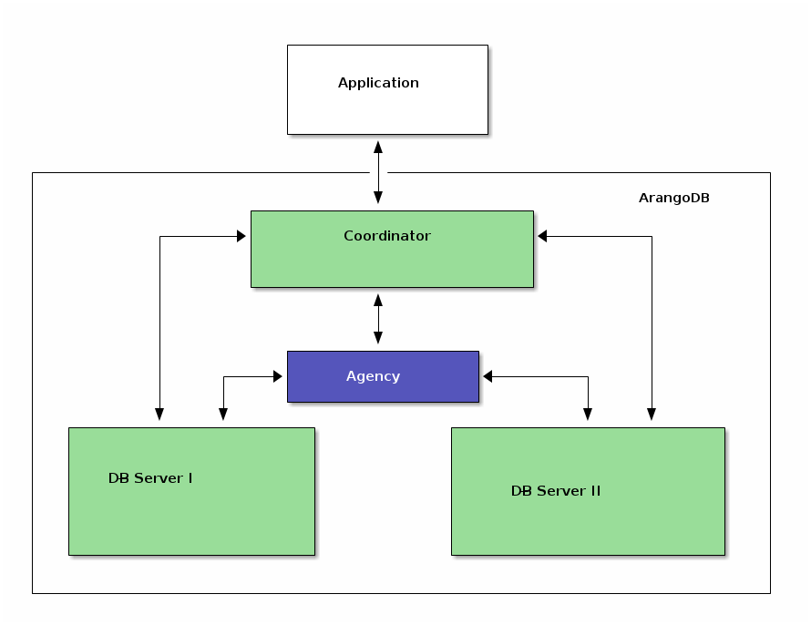
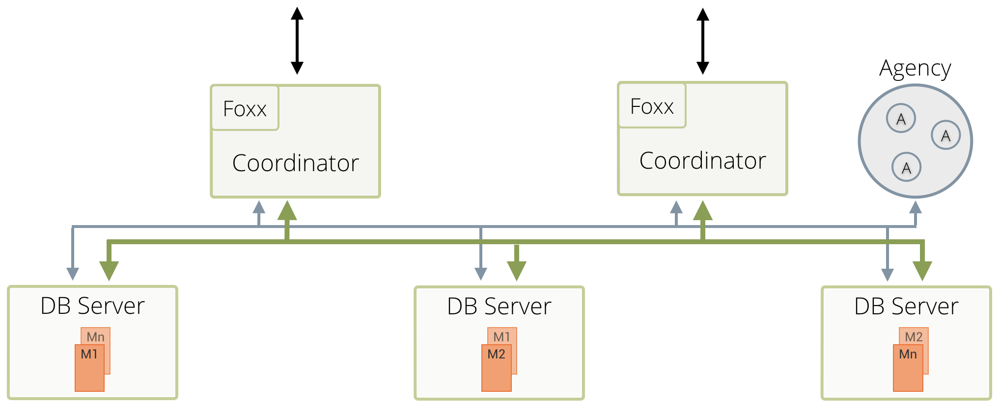
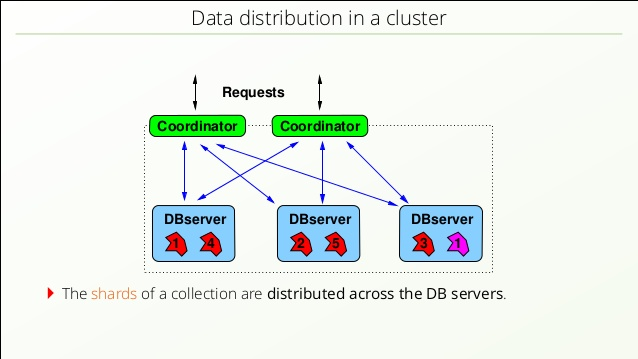
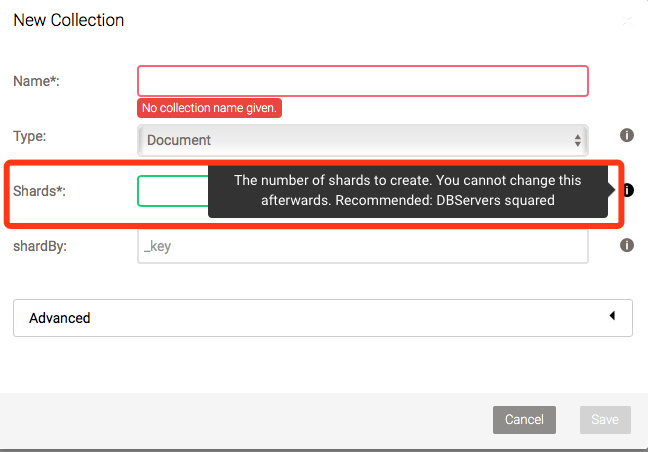

# ArangoDB集群

本文以简短的篇幅，介绍ArangoDB集群相关的内容，包括 结构、工作原理 和 安装部署，并在最后介绍了一套适合我们的操作指南。

# 1. ArangoDB 集群介绍

关于ArangoDB集群的资料，能看到内容非常少，主要集中在官方文档中的 「架构」这一节。

地址：https://docs.arangodb.com/3.3/Manual/Scalability/Architecture.html

## 1.1 概述

ArangoDB，是无单点故障的，主-主模式的，CP架构的集群。

这一句话有3个点：

- CP架构：即在CAP中，选择了`一致性高于可用性`；
- 主-主模式：意思是每一个点都可以写；
- 无单点故障：说明有冗余容灾机制，有选举机制。

## 1.2 集群的结构

集群中有4种节点：Agent，Coordinator，Primary 和 Secondary。前三者必选，Secondary可选。

官方文档中，此处应该要有张架构图，可惜文档不是我写的，它没有。

我从其他地方找了几张图，供参考。









所有节点都是同一个命令启动的，只是参数不同。

Agent：集群的配置中心，Raft一致性协议解决配置冲突，高可用的KV存储。

Coordinator：接收客户端请求，无状态，与Primary交互。

Primary：主存储节点，多个，所谓的`主-主`指的就是它了。

Secondary：可选，可以理解成Primary的备份。

## 1.3 分布式机制

### 1.3.1 可用性

可用性，要求数据保存副本，即做数据冗余。ArangoDB数据存储的基本单位是Shard，听上去比较抽象。换句话说，一个Shard就是一个Document，就容易理解了。

> **预备知识**
>
> ArangoDB的数据数组组织：ArangoDB -> DataBase -> Collection -> Document，从前到后，都是一对多的关系。
>
> ArangoDB：一个库，下面可以建多个DataBase
>
> DataBase：数据库，下有多个Collection
>
> Collection：集合，下有多个Document
>
> Document：文档，集合中的元素

在创建集合时，可以指定副本数，默认是根据`_key`做Hash来分发，具体算法文档中没有明确说明，猜测可能是`一致性Hash`。



### 1.3.2 一致性

ArangoDB是CP集群，即一致性高于可用性。它的一致性，指的是在Primary级别采用同步复制，保证强一致；Secondary则从Primary异步复制，保证最终一致。

因为客户端的读写只操作Primary，所以，ArangoDB是一个强一致性的分布式数据库。

- 同步复制：参考下一节「写流程」
- 异步复制：可以理解成定时备份

## 1.4 写流程

- 客户端发起请求
- 负载均衡，找一个Coordinator
- Coordinator根据shardBy，找到Leader
- Leader自己存好后，发送Followers
- 所有Followers返回成功后，Leader告诉Coordinator写入成功
- 如果Leader 3秒还没有收到Follower返回，认为其掉线
- 如果Coordinator 15秒没有心跳，认为其掉线，触发重选Leader

**注意：** Leader和Follower不同于一些集群的Master-Slave。Leader是针对`Shard`选举的，集群中所有的`Primary`地位是一样的。并不存在`Master Primary`。

## 1.5 读流程

> TODO 暂时还没有发现相关文档

# 2. 方案选型

ArangoDB集群，常用的共有4种方案：Mesos/DCOS，Docker/Compose，ArangoDB-Starter，纯手工。

因为ArangoDB中的节点，有4种角色（3个必须，1个非必须），配置起来比较复杂，一般不建议用纯手工的方式配置。

## 2.1 Mesos/DCOS

Mesos/DCOS是官方首推的集群方案，官方性能测试也是在此环境上进行的。但搭建DCOS至少需要5台机器，一旦搭好了DCOS，后面会非常简单。目前来看，项目中配置机器数量不会达到5台，故此方案不适用。

## 2.2 Docker/Compose

Docker/Compose是另外一套比较好的方案，官方有提供Docker镜像，使用Compose编排集群内的节点，使用起来会非常灵活，又一目了然。但是，Docker早已停止支持CentOS6，而现场的机器目前没有升级到7及以上的计划，并在看的到的未来，仍会在6上运行。故此方案也不适用。

## 2.3 ArangoDB-Starter

最后，只剩下官方提供的ArangoDB-Starter这一套方案了。该方案比纯手工做了一步简化：把3个必须的角色打包，集成到一个命令中。

# 3. 安装ArangoDB(内网)

本文以CentOS 6.5 和  ArangoDB 3.3.8 为例，离线安装。

## 3.1 安装依赖

在连网的CentOS 6.5上，用yum deplist arangodb3可以查出，3.3.8版本依赖3个包：

```
bash.x86_64 4.1.2-48.el6
glibc.x86_64 2.12-1.209.el6
openssl.x86_64 1.0.1e-57.el6
```

前2个包已经有了，第3个包需要下载安装。

下载地址：https://centos.pkgs.org/6/centos-x86_64/openssl-1.0.1e-57.el6.x86_64.rpm.html

```
rpm -ivh openssl-1.0.1e-57.el6.x86_64.rpm
```

## 3.2 安装ArangoDB

ArangoDB 分社区版 和 企业版，生产环境建议用 `企业版`。从福建反馈来看，之前用社区版不稳定，出现假死、自动重启等问题，改用企业版后都没出现过。

从官方下载企业版：https://www.arangodb.com/download-arangodb-enterprise/install-enterprise

安装：

```
rpm -ivh arangodb3e-3.3.8-1.x86_64.rpm
```

**注：** 如果之前有装过 `社区版`，则需要加`--replacepkgs`参数，替换安装。

# 4. 部署：ArangoDB-Starter

## 4.1 简介

以下是该方案的特点：

- ArangoDB安装包自带，无需额外安装
- 可以单机，也可以多台机器
- 创建集群时有Master，集群创建好了则无此概念
- 启动和运行至少需要3个节点，少于3个节点无法正常工作
- 节点数 > 3，无单点故障
- 节点会启动agent，dbserver，coordinator这3个角色
- 默认AgencySize为3，即前3个节点会启动agent，第4个开始，只启动dbserver 和 coordinator

## 4.2. 使用方式

**注：** 以下指令在`3.3.8`版本测试通过，不同版本可能会有微小的区别。

```shell
# 启动Master
arangodb --starter.data-dir=/root/arangodb/db1 start

# 启动其他
arangodb --starter.data-dir=/root/arangodb/db2 --starter.join 10.199.132.222 start
arangodb --starter.data-dir=/root/arangodb/db3 --starter.join 10.199.132.222 start
arangodb --starter.data-dir=/root/arangodb/db4 --starter.join 10.199.132.222 start
```

**重申：** Master 概念只是创建集群时的叫法，创建好之后，无Master节点，所有节点地位是一样的。

全部停止：

```shell
pkill -f arangod
```

再次启动：

```sh el l
arangodb --starter.data-dir=/root/arangodb/db1 start
arangodb --starter.data-dir=/root/arangodb/db2 start
arangodb --starter.data-dir=/root/arangodb/db3 start
arangodb --starter.data-dir=/root/arangodb/db4 start
```


**注：** 本示例在多台机器上同样可用。

# 5. AQL常用写法

对于熟悉SQL的同学，可以通过AQL与SQL的比较，来学习这门查询语言，其中的例子非常有用。

AQL与SQL的比较：https://www.arangodb.com/why-arangodb/sql-aql-comparison/

链接中有简单的例子，下面列举有用的，复杂一点的几个例子。

## 5.1 分组查询并排序

集合TPIN_VERTEX_WWD 存在团伙的Key：community_label，根据条件抽出团伙。

```AQ
for v in TPIN_VERTEX_WWD
filter v.ishuman == "0" // 过滤企业，and 用 多个filter，or 用一个filter，条件中间加 or 关键字
filter v.community_label > 0 // 过滤community_label 大于0的，等于0的不是团伙
collect thKey = v.community_label // 按照 团伙的Key来分组
AGGREGATE xkje = SUM(v.xkje), // 分组内部的SUM
qys = count(v),  // 内部的count
xkfps = SUM(v.xkfps) // 另一个SUM
filter qys > 3  // 根据分组后的条件来过滤，即 group by having
sort xkje desc // 用分组后的来排序
return {key: thKey, xkje: xkje, qys: qys, xkfps: xkfps}
```

## 5.2 使用变量

查询某一团伙所有的点和边。团伙只和点关联，和边并没有关联。

如果用图遍历来查团伙中所有的点和边，数据量大了，图深了，性能非常差。图的深度设的少了，很可能会不全。

但是，如果单独查 点，再根据点查边，就会非常快。

```AQL
LET ids = (FOR v IN TPIN_VERTEX_WWD 
			FILTER v.community_label == @thKey 
			RETURN v._id) // 点的数组赋值为一变量，放到最前面
FOR e IN TPIN_EDGE_WWD 
FILTER e._from in ids 
FILTER e._to in ids 
RETURN DISTINCT e
```

**注意：** 此例中，不要将 LET 放在 FOR 之后，FILTER之前，那样性能会差。实际测试过一个例子，边总数为2000，点的数量为1000，时间上一个是9ms，一个是118ms。

# 6. AQL性能优化

要把AQL想象成编程语言，而不是SQL。

## 6.1 使用LET

见 5.2 使用变量

## 6.2 图查询广度优先

在用图查询时，一般都加以下选项，用广度优先，性能好很多。

```
OPTIONS {bfs: true, uniqueVertices: 'global'}
```

## 6.3 索引


