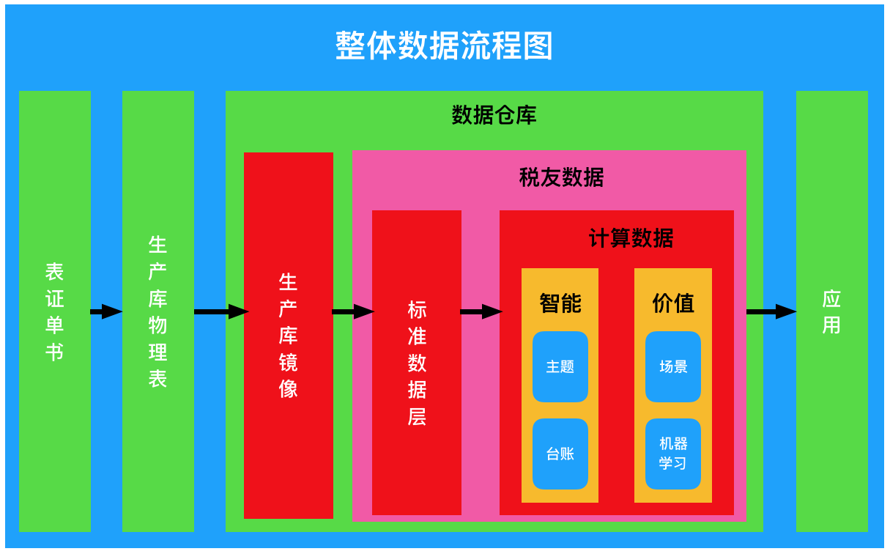

# 数据资产相关概念梳理

为了进一步明确数据资产要完成的功能，有必要对当前的方案做一次概念梳理，明确定义数据资产中的「概念」，避免歧义，降低后期沟通成本。

本文所有的命名，是提供一个草稿，供大家基于它来修改，希望能通过讨论确定下来最终名称，大家之后统一口径。

# 1. 整体数据流

- 整体数据流程图：展示数据从「业务表单」到「应用」的整个过程。

- 表证单书：业务表单，纸质表单 或 电子表单，是数据最初始的来源，如《城镇土地使用税税源明细表》、《非居民企业认定信息表》等。
- 生产库物理表：生产库开放给我们的表，是我们「数据仓库」的数据来源。
- 数据仓库：我们公司自己管理的数据库，Oracle 或 大数据平台。
- 生产库镜像：将生产库的数据搬过来，不做任何改动。
- 税友数据：我们公司自己定义的数据结构和加工规则的数据。
- 标准数据层：是我们自己定义的第一份数据，是「计算数据」和「应用」的数据来源，即 所有应用的数据，都是由「标准数据层」提供。这份数据要求最高，要全面、准确，并保持最新。
- 计算数据：基于「标准数据层」加工而来，为应用服务。
- 应用：所有使用我们数据的应用。

# 2. 基本概念

数据资产管理中，有许多基本的概念，如 数据元、数据表、数据项、血缘关系等。之前个别概念不是很明确，在这里统一口径。

## 2.1 数据项

「数据项」：指「表证单书」中 某一单元格（某一行某一列）的内容，或 实体数据表中的某一列，是数据组织的最小单位。

## 2.2 数据元

「数据元」：为了对「数据项」分类管理而定义的一个概念。

按照是否参对应具体数据项，可以分为「抽象数据元」和「具体数据元」。

「抽象数据元」：是一个抽象概念，大的分类，如金额、税额，可以派生出「抽象数据元」或「具体数据元」。

「具体数据元」：是一个具体化的概念，可以对应到一个或多个「数据项」，如 纳税人名称、增值税全部销售额等。

「具体数据元」对应的「数据项」中，有且只有一个是「标准数据项」，其他为「参考数据项」。

「标准数据项」所在的表一定落在「标准数据层」*（暂定，以后计算数据也有可能会加入到标准中）*。

所有的「标准数据项」放在一起，组成了「标准数据项清册」。

**例：** `税额` 是 一个「抽象数据元」，可以派生出`应纳税额`也是一个「抽象数据元」，从`就纳税额`中派生出`增值税一般项目本期应纳税额`是一个「具体数据元」。

- 金额
- 税额
  - 应纳税额
    - 增值税一般项目本期应纳税额
    - 增值税货物及劳务核定本期应纳税额
  - 未缴税额
    - 增值税即征即退本期期末未缴税额
    - 增值税一般项目本期期初未缴税额

「数据元」一般为一棵树，叶子节点为「具体数据元」，非叶子节点为「抽象数据元」。

## 2.3 表证单书

在系统中，只维护「表证单书」图片，不维护「表证单书」的结构。

「表证单书」的数据存放在「电子表单」中，已经是「数据表」的范筹。

但是，「税务工作人员」只熟悉「表证单书」，不熟悉「电子表单」，所以「血缘关系」的源头是「表证单书」。

## 2.4 数据表

数据仓库中所有的表，包括「生产库镜像」和 我们公司自己定义的所有数据表，不包括临时表。

需要维护表的「版本」、「加工时间」等「数据内容」信息。

## 2.5 数据列

「数据表」范围内的所有列。

「数据列」都是「数据项」，「数据项」另外可指「表证单书」中的「数据项」

## 2.6 表模型定义

为了监控「生产库物理表」的改变，识别「表结构」与「pdm设计文档」的不同，在「数据表」 和「数据列」之外，增加了「表模型定义」和「列模型定义」。

「数据表」和「数据列」中的存储的是线上数据库「实际结构」。

「表模型定义」和「列模型定义」中存储的是「设计的结构」。

正常情况下，这两者的结构要保持完全一致。

因「生产库物理表」可能并不是我们公司设计的，拿不到「pdm设计文档」，其「表模型定义」也是从线上数据库的「实际结构」而来，但需要「手工确认」才更新「表模型定义」和「列模型定义」。

## 2.7 列模型定义

略

## 2.8 标准数据层

标准数据层是我们自己定义的第一份数据，所有应用使用的数据，全部从这一份数据 或 基于这一份数据加工的数据而来。

「标准数据项」全部落在「标准数据层」。

## 2.9 血缘关系

血缘关系描述数据的来源及去向。

按照血缘关系的建立，可以分2类：手工配置 和 脚本导入。

**理论上：**

「税友数据」中的所有内容，都是通过我们公司自己的「加工脚本」生成的，其血缘关系可以通过解析「加工脚本」获取。

但从「表证单书」到「生产库镜像」是没有「加工脚本」的，这部分血缘关系需要手工配置。

**实际上：**

「标准数据层」和「生产库镜像」相似库极高，实际上是建立「表证单书」到「标准数据层」的「映射关系」。

**注：** *这一点是上周五开会时*，我个人理解，不太确定。

## 2.10 数据服务接口

常规的服务接口，如HTTP、dubbo等。

## 2.11 服务订单

某用户申请的一个服务，在「数据服务接口」上，做「行」或「列」的数据限制。

**注：** *根据上周五开会，我个人理解，现在还没完全搞明白。*

