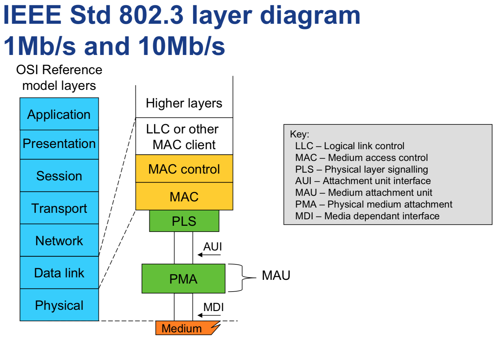
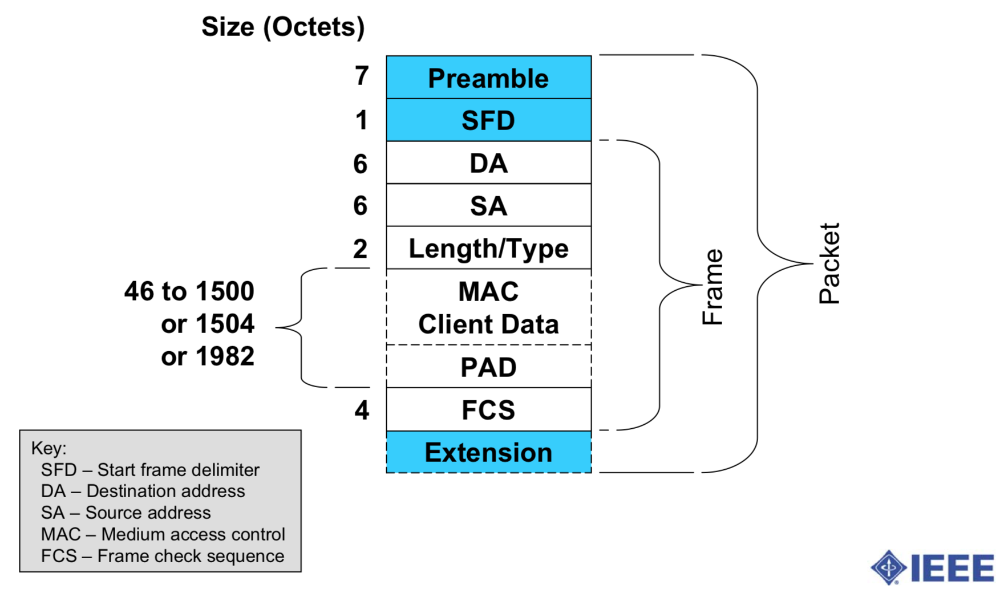
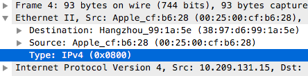

一般说的二层，指的是「数据链路层」，即Data Link Layer。

# 1. 二层的定义

通俗的说，数据链路层是用来对接不同的物理设备(MAC)，向上提供统一的接口(LLC)的一层，因为它解决了兼容不同物理设备的问题，所以，研究网络分层往往把它当作第一层，就像汇编语言作为最低层的编程语言一样。

以下是比较专业的说法：

------

**数据链路层**（Data Link Layer）是[OSI参考模型](https://zh.wikipedia.org/wiki/OSI模型)第二层，位于[物理层](https://zh.wikipedia.org/wiki/物理层)与[网络层](https://zh.wikipedia.org/wiki/网络层)之间。在广播式多路访问链路中（局域网），由于可能存在介质争用，它还可以细分成[介质访问控制](https://zh.wikipedia.org/wiki/介质访问控制)（MAC）子层和[逻辑链路控制](https://zh.wikipedia.org/wiki/逻辑链路控制)（LLC）子层，[介质访问控制](https://zh.wikipedia.org/wiki/介质访问控制)（MAC）子层专职处理介质访问的争用与冲突问题。

[局域网](https://zh.wikipedia.org/wiki/區域網路)与[广域网](https://zh.wikipedia.org/wiki/廣域網路)皆属第一、二层。

**媒体接入控制**（英语：**M**edia **A**ccess **C**ontrol，缩写：**MAC**）子层，是[局域网](https://zh.wikipedia.org/wiki/局域网)中[数据链路层](https://zh.wikipedia.org/wiki/数据链路层)的下层部分，提供定址及媒体访问的控制方式，使得不同设备或网络上的节点可以在多点的网络上通信，而不会互相冲突，上述的特性在[局域网](https://zh.wikipedia.org/wiki/局域网)或者[城域网](https://zh.wikipedia.org/wiki/城域网)中格外重要。早期网络发展时以MAC判别个网络接口之位置，但后来互联网发展后，才有IP之制定与使用[[来源请求\]](https://zh.wikipedia.org/wiki/Wikipedia:列明来源)。若只是两台设备之间[全双工](https://zh.wikipedia.org/wiki/全雙工)的通信，因为两台设备可以同时发送及接收数据，不会冲突，因此不需要用到MAC协议。

MAC子层作为[逻辑链路控制](https://zh.wikipedia.org/wiki/逻辑链路控制)子层及[物理层](https://zh.wikipedia.org/wiki/物理层)之间沟通的介质，提供了一种定址的方法，称为实体地址或[MAC地址](https://zh.wikipedia.org/wiki/MAC地址)。MAC地址是唯一的，每张[网卡](https://zh.wikipedia.org/wiki/網卡)的MAC地址都不一样，因此可以在一[子网](https://zh.wikipedia.org/wiki/子網)中发送数据包到特定的目的设备。此处的子网是指没有[路由器](https://zh.wikipedia.org/wiki/路由器)的实体网络（例如以太网）。

**逻辑链路控制**（英语：Logical Link Control，简称**LLC**）是[局域网](https://zh.wikipedia.org/wiki/局域网)中[数据链路层](https://zh.wikipedia.org/wiki/数据链路层)的上层部分，[IEEE 802.2](https://zh.wikipedia.org/wiki/IEEE_802.2)中定义了逻辑链路控制协议。用户的数据链路服务透过LLC子层为网络层提供统一的接口。在LLC子层下面是MAC（[介质访问控制](https://zh.wikipedia.org/wiki/介质访问控制)）子层。

IEEE标准中增加了这个子层，该子层透过在IP包上加了8位元的目的地址服务接入点和源地址服务接入点来保证在不同网络类型中传输。另外，有一个8或16位的控制字段用于象流控制的辅助功能。

# 2. 协议栈

## 2.1 以太网二层协议

在以太网协议(IEEE802.3)中，有如下一张图

从图中可以看出：

- Frame的确如前面据说，分为这几个部分
- 在Frame的外层，是Packet
- Packet可以理解成MAC，Frame是LLC
- Packet分为前8个字节，Frame，和扩展的内容
- 前8个字节，定义了包的开始，分为前7个字节Preamble，翻译为「前导码」和第8个字节SFD开始帧分隔符
- 前7个字节的内容均为10101010B，第8个字节的内容为10101011B（图中看不出来）
- Frame中，对三层协议协议中的内容也做了定义，至少46个字节，如果不够，就用PAD来补齐

那如何知道帧何时结束呢？

##### **这应该是和物理层密切相关的 「媒体访问控制层」 要解决的问题。**

## 2.2 抓包看看

Wireshark协议栈如下图：

Wireshark中一般无法显示CRC校验的这4个字节。

# 3. 几个问题

## 3.1. 物理层有没有协议栈？

物理层和数据链路层很难分开说，如最常用的以太网协议(IEEE802.3)，无线局域网协议WI-FI(IEEE802.11)，都是定义物理层和数据链路层的。

物理层是有协议栈的，但是，它的协议栈并不通用，每种物理层对应的协议栈不一样，需要单独研究。

因为从二层的LLC及以上，协议栈通用的，按照这样来理解，物理层没有协议栈。

## 3.2. 在网络信号中，一个完整的Frame如何定义？

从官方图中能够看出，实际传输的包是Packet，包括MAC和LLC，Frame是LLC传输的内容。

于是，Frame内容的完整性，是由Packet来决定的，Packet依赖物理层，不同物理层可以有不同的实现。

所以，不好统一的说Frame是由什么分隔。

## 3.3. 二层设备如何处理二层协议栈？

二层主要内容是`DestinationAddress`，即下一个网络设备是谁，如果`DestinationAddress`是自己，那就是需要解`三层`，如果不是自己，那就不需要解`三层`。对交换机而言，不是自己，但是是自己知道的一个网口，那就把这个包发到对应的网口。

## 3.4. 二层设备在解决什么问题？

在解决相邻设备 或 同一个局域网通信的问题。

## 3.5. 工作在二层上的协议有哪些？

### 3.5.1 ARP(LLC)

**地址解析协议**（英语：**A**ddress **R**esolution **P**rotocol，缩写：**ARP**）是一个通过解析[网络层](https://zh.wikipedia.org/wiki/网络层)地址来找寻[数据链路层](https://zh.wikipedia.org/wiki/数据链路层)地址的[网络传输协议](https://zh.wikipedia.org/wiki/网络传输协议)，它在[IPv4](https://zh.wikipedia.org/wiki/IPv4)中极其重要。ARP最初在1982年的[RFC](https://zh.wikipedia.org/wiki/RFC) [826](https://tools.ietf.org/html/rfc826)（征求意见稿）[[1\]](https://zh.wikipedia.org/wiki/地址解析协议#cite_note-1)中提出并纳入[互联网标准](https://zh.wikipedia.org/wiki/互联网标准) STD 37. **ARP** 也可能指是在多数[操作系统](https://zh.wikipedia.org/wiki/操作系统)中管理其相关地址的一个进程。

ARP的目的，是通过IP地址，找到它的MAC地址，虽然工作在二层，只在局域网中起作用，但是，事实上，它是有三层协议的内容的，像IP地址，就是三层协议头中的内容。

### 3.5.2 Ethernet(MAC)

**以太网**（英语：Ethernet）是一种[计算机](https://zh.wikipedia.org/wiki/计算机)[局域网](https://zh.wikipedia.org/wiki/局域网)技术。[IEEE](https://zh.wikipedia.org/wiki/IEEE)组织的IEEE 802.3标准制定了以太网的技术标准，它规定了包括[物理层](https://zh.wikipedia.org/wiki/OSI模型)的连线、电子信号和[介质访问层](https://zh.wikipedia.org/wiki/OSI模型)[协议](https://zh.wikipedia.org/wiki/网络协议)的内容。以太网是当前应用最普遍的局域网技术，取代了其他局域网标准如[令牌环](https://zh.wikipedia.org/wiki/令牌环)、[FDDI](https://zh.wikipedia.org/wiki/FDDI)和[ARCNET](https://zh.wikipedia.org/w/index.php?title=ARCNET&action=edit&redlink=1)。

以太网的标准[拓扑](https://zh.wikipedia.org/wiki/網絡拓撲)结构为[总线型拓扑](https://zh.wikipedia.org/wiki/匯流排拓撲)，但当前的快速以太网（[100BASE-T](https://zh.wikipedia.org/w/index.php?title=100BASE-T&action=edit&redlink=1)、[1000BASE-T](https://zh.wikipedia.org/wiki/1000BASE-T)标准）为了减少冲突，将能提高的网络速度和使用效率最大化，使用[交换机](https://zh.wikipedia.org/wiki/網路交換器)（Switch hub）来进行网络连接和组织。如此一来，以太网的拓扑结构就成了[星型](https://zh.wikipedia.org/wiki/星型网)；但在逻辑上，以太网仍然使用总线型拓扑和[CSMA/CD](https://zh.wikipedia.org/wiki/CSMA/CD)（Carrier Sense Multiple Access/Collision Detection，即载波多重访问/碰撞侦测）的总线技术。

### 3.5.3 Wi-Fi(MAC)

**Wi-Fi**（发音： [/ˈwaɪfaɪ/](https://zh.wikipedia.org/wiki/Help:英語國際音標)[[1\]](https://zh.wikipedia.org/wiki/Wi-Fi#cite_note-1)[[2\]](https://zh.wikipedia.org/wiki/Wi-Fi#cite_note-2)[[3\]](https://zh.wikipedia.org/wiki/Wi-Fi#cite_note-3)），在[中文](https://zh.wikipedia.org/wiki/中文)里又称作“无线热点”，是Wi-Fi联盟制造商的[商标](https://zh.wikipedia.org/wiki/商標)做为产品的品牌认证，是一个创建于[IEEE 802.11](https://zh.wikipedia.org/wiki/IEEE_802.11)标准的[无线局域网](https://zh.wikipedia.org/wiki/无线局域网)技术。基于两套系统的密切相关，也常有人把Wi-Fi当做IEEE 802.11标准的同义术语。“Wi-Fi”常被写成“**WiFi**”或“**Wifi**”，但是它们并没有被Wi-Fi联盟认可。

### 3.5.4 NDP(LLC)

**邻居发现协议**（英语：**Neighbor Discovery Protocol**简称：**NDP**或**ND**）是[TCP/IP](https://zh.wikipedia.org/wiki/TCP/IP)协议栈的一部分，主要与[IPv6](https://zh.wikipedia.org/wiki/IPv6)共同使用。它工作在数据链路层，负责在链路上发现其他节点和相应的地址，并确定可用路由和维护关于可用路径和其他活动节点的信息可达性。（[RFC 4861](http://tools.ietf.org/html/rfc4861), 2007）