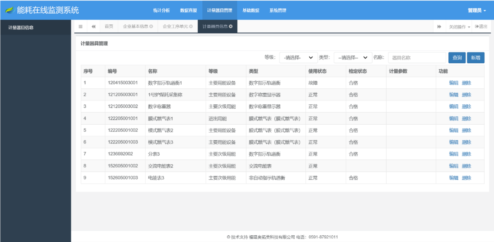

本文从宏观上分析设计端设备相关的功能。

# 1. 整体设计

## 1.1 数据流向图

## 1.2 端设备工作流程

- 在端设备的配置文件中，配置「注册系统地址」和「企业的省级行政区划代码」
- 端设备系统启动时，连接「注册系统」，获取「基础数据下载地址」并下载「基础数据」，后台每天检测「基础数据版本」，如果有更新，则更新本地的「基础数据」
- 在端设备页面，配置企业「基本信息」、「能耗数据点」和「计量器具」
- 企业基本信息根据企业情况如实填写
- 能耗数据点，需要根据「基础数据」填写，并可以关联到「数据系统」中的「点」，如不关联，则需要手工录入
- 「端设备」后台任务每天定时从「数据系统」中同步「能耗数据」到「端设备」数据库
- 「端设备」页面可以手工录入能耗数据，也可以修改「数据系统」同步过来的能耗数据
- 「端设备」页面需要「人工确认」才会上报到「省平台」
- 「端设备」可以查询历史上报信息

## 1.3 端设备架构图

# 2. 模型

## 2.1 基础数据

该部分严格按照《03 重点用能单位能耗在线监测系统-系统平台接口协议规范.pdf》`8.4 基础数据下载`中定义的格式。

## 2.2 基础信息

基础信息主要包含「企业基本信息」和「能耗数据点」两部分。

「企业基本信息」格式按照《03 重点用能单位能耗在线监测系统-系统平台接口协议规范.pdf》`8.6 用能单位基础信息上传`中定义的格式。

「能耗数据点」在标准的基础上，增加与「数据系统」中的「数据点」的关联。

## 2.3 计量器具

计量器具严格按照《03 重点用能单位能耗在线监测系统-系统平台接口协议规范.pdf》`8.7 用能单位计量器具信息上传`中定义的格式。

**注：**该部分数据考虑从 采集配置侧读取，但那边信息很可能是不全的。

## 2.4 能耗数据

该部分在《03 重点用能单位能耗在线监测系统-系统平台接口协议规范.pdf》`8.8 用能单位采集数据上传`中定义的基础上，增加「状态」字段，其可能取值：待确认、确认、上报成功、上报失败等。

# 3. 页面

## 3.0 基础数据

该部分可以不提供页面，其中的数据，主要是为了构造出「基础信息」。

## 3.1 基础信息

### 3.1.1 企业基本信息

企业基本信息表单，可参考以下页面：

### 3.1.2 能耗数据点

对表格的增删改查

| 编码 | 名称 | 工序 | 工序单元 | 设备类型 | 设备编号 | 采集对象类型 | 能源分类 | 用途编码 | 采集来源 | 数据最大值 | 数据最小值 | 采集频率 | 采集系统名称 | 范围 | 关联数据点 |
| ---- | ---- | ---- | -------- | -------- | -------- | ------------ | -------- | -------- | -------- | ---------- | ---------- | -------- | ------------ | ---- | ---------- |
|      |      |      |          |          |          |              |          |          |          |            |            |          |              |      |            |

## 3.2 计量器具

对表格的增删改查，列的信息参考下图

## 3.3 手工录入及数据确认

参考以下页面

## 3.4 历史数据查询

参考以下页面

