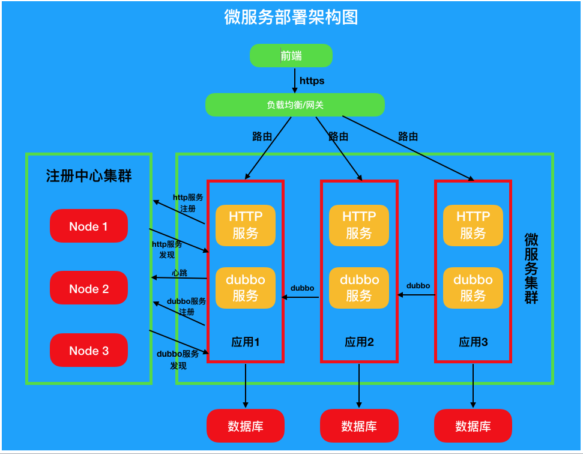

本文介绍了锐创EMS系统的技术选型与设计。

先整体介绍技术的整体架构，再根据具体的设计原则，对其中的内容加以阐述，使读者明白设计的出发点、依据的原则 及带来的好处。

# 1. 技术总览

下面是其中一张架构图，整体采用前后端分离的架构，后台使用Java技术栈构建的微服务。

## 1.1 前端

前端整体选用VUE + Element，并涉及node.js，Webpack，Echart等前端通用技术，不一一列出。

## 1.2 负载均衡/网关

后台用高性能的Nginx作为Web静态文件服务器、反向代理 和 负载均衡，在规模更大时，增加Zuul做负载均衡 和 网关。

## 1.3 注册中心

使用Nacos作为dubbo的注册中心 和 配置中心，在规模更大时，增加Eureka作为http服务的注册中心，与Zuul网关配合使用。

## 1.4 微服务技术

常规模式下，使用dubbo微服务跨模块调用，并可选用http微服务模式支持更大规模的部署。

## 1.5 后台技术

后台选用Java1.8、Maven4.0，SpringBoot2.0.9，Ebean11.39，dubbo2.7.1等，细节性的技术不一一列出，下文会提及一些关键技术。

## 1.6 关系数据库

关系数据库选用MySQL5.7，并支持Postgresql，Oracle，DB2，SQL Server等。

## 1.7 时序数据库

选用Influxdb作为实序数据库，存储所有的时序数据。

## 1.8 Redis

采用Redis作为缓存数据库。

# 2. 设计原则和具体体现

下面逐个介绍系统的设计原则，并举例说明这些原则的具体体现。

## 2.1 模块化

系统整体使用模块化的思想，将整个系统按照业务分为几十个模块，如 文件模块、设备模块、采集模块、报表模块、报警模块、用户模块等，其中大一些的模块还会有子模块，如 采集模块 有 采集器子模块、OPC子模块、Modbus子模块、SQL子模块、Bacnet子模块等。

麻省虽小，五脏俱全。每一个模块有自己的HTTP服务、Dubbo服务和数据库表，可以单独部署、独立启动。

模块内高内聚，模块间松耦合，模块间调用走RPC协议。

## 2.2 高质量

从众多开源项目中，精挑细选了一些高质量的组件，如SpringBoot、Dubbo、Influxdb、Shiro、Ebean等，这些软件的质量，是非常重要的基石。

软件开发遵守行业通用规范，并严格遵守《阿里巴巴Java编码规范》，使用Sonar、Findbugs等工具检测代码质量，是我们产品质量的重要保证。

## 2.3 安全性

在安全性方便，使用Shiro作为安全框架，JWT作为认证方案，密码采用加盐加密算法，并使用Ebean防止SQL注入等。

## 2.4 扩展性

### 2.4.1 业务扩展性

我们有资深业务专家，对可以预见到的业务场景，均留有扩展点。如 数据采集优先支持采集器接入，并预留好OPC协议接入、Modbus协议接入。

### 2.4.2 技术扩展性

整体模块化设计，功能很容易水平扩展，使用微服务部署，具有天然的横向扩展能力。

## 2.5 兼容性

系统由能源行业多年经验的架构师设计，考虑到各种场景下的兼容性，并将之做到了极致。如 数据库不仅支持常用的MySQL、Oracle，我们还支持SQL Server、DB2、Postgresql、SQLLite、HANA、SQLANYWHERE、HSQLDB、CLICKHOUSE、COCKROACH等小众数据库。

## 2.6 性能

一方面，我们考虑大数据量的读写速度，另一方面，我们考虑数据的无损压缩，使之占用更少的磁盘空间。

- 单节点写入点位：50万/秒；
- 10年分钟级数据随机读取：<1秒
- 10万点位10年分钟级数据占用磁盘：<5T

## 2.7 易维护

因为设计优良，模块内很小，模块间通过接口隔离，使得问题修改 和 二次开发变得非常容易。

在系统中，提供丰富的配置页面，甚至配置文件的管理都可以由Nacos配置中心统一管理，使得绝大部分操作可以在页面完成。

## 2.8 自动化运维

在开发过程中，我们使用git管理代码，由TeamCity负责持续集成，负责编译、打包、部署、重启，并调用SonarServer进行代码质量检查，并发布代码质量报告。

